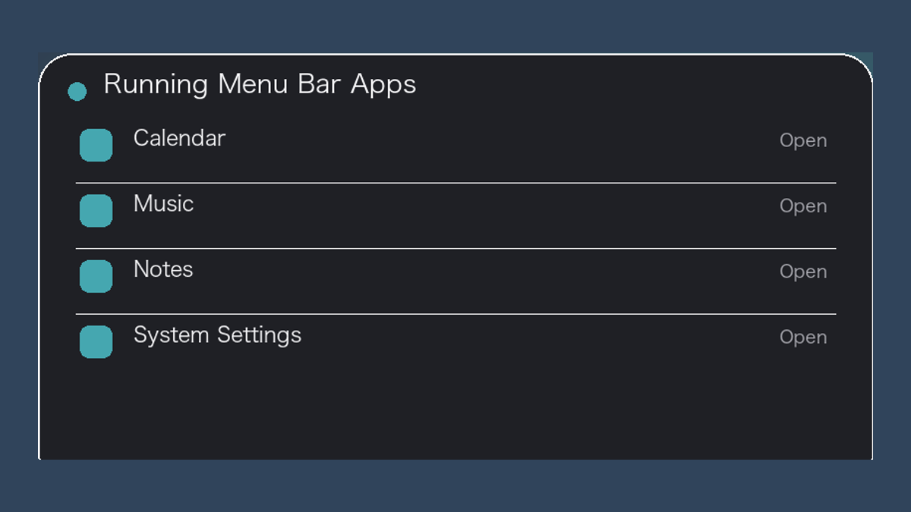
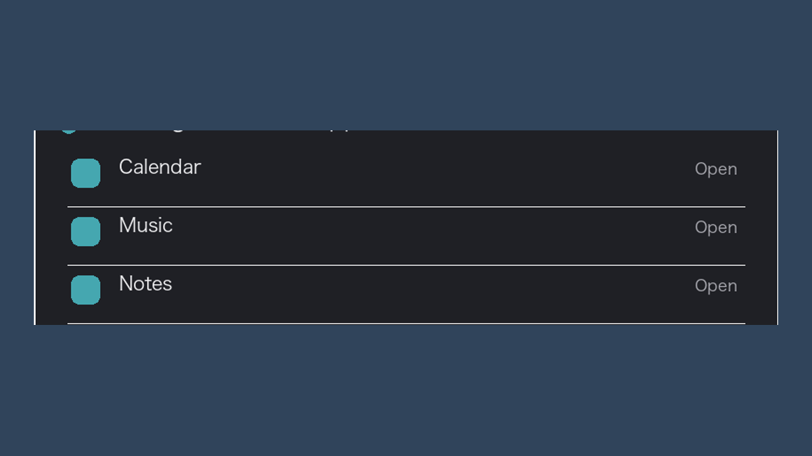
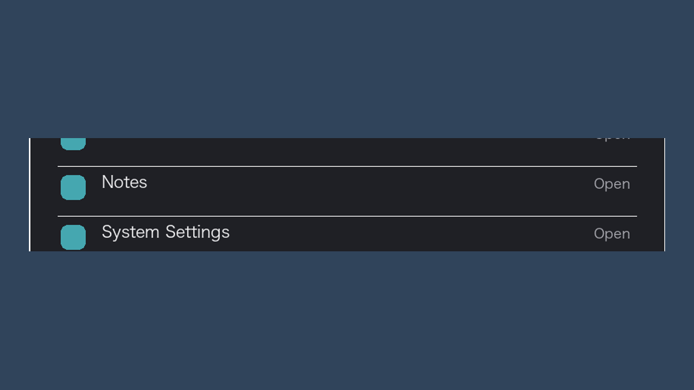

<p align="center"></p>

<h1 align="center">MenuBarShelf</h1>
<p align="center">菜单栏太挤？把仍在运行的后台应用集中找回来。</p>

<p align="center">
  
  
  
</p>

## 功能一览

### 后台应用，集中到一处

正在运行、适合从菜单栏访问的 App 会汇集成一张清晰列表。

<p align="center"></p>

### 被挤出的应用也找得到

菜单栏再拥挤，也能从列表重新发现仍在运行的工具。

<p align="center"></p>

### 点击名称，直接唤醒

无需翻找 Dock 或“应用程序”文件夹，一次点击即可打开目标 App。

<p align="center"></p>

## 亮点

- 列出正在运行、适合从菜单栏访问的应用。
- 点击名称即可打开或唤醒对应 App。
- 原生 AppKit 菜单，自动适配明暗菜单栏。
- 默认不请求辅助功能权限，也不使用私有 API。
- 菜单栏图标不可见时，可用 `Control + Option + Command + M` 打开。

> macOS 公共 API 无法保证第三方图标永远处于最右侧。MenuBarShelf 使用最小图标和全局快捷键作为可靠后备。

## 安装与开发

从 [GitHub Releases](https://github.com/ORDOABCHAOWT/menu-bar-shelf/releases) 下载 App，或从源码构建：

```bash
swift run MenuBarShelfCoreChecks
./build_app.sh
```

构建产物位于 `dist/MenuBarShelf.app`。

## License

[MIT](LICENSE) © ORDOABCHAOWT
